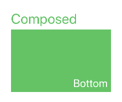

#  Composed

---

**Make designing views in `layoutSubviews()` simpler with extensions to `CGGeometry` structs such as `CGRect`, `CGSize`, and `CGPoint`.**

Composed is in its early stages of development. Thanks for your interest!

## Features

- [x] Create `CGRect` from `CGSize` by pinning to a `CGPoint`
- [x] Supports pinning by origin, center, and any corner
- [x] Easily access `CGRect` corners by value instead of deriving them
- [x] Adds convenience functions and variables such as `center` to `CGRect` and `offset(by:)` to `CGPoint`

## Usage

The core concept of layout using `Composed` is making manual layout easier to read.

```swift
// Composed
boxView.frame = CGSize(width: 200, height: 125)
    .setCenter(bounds.center)
    
// CGGeometry
let boxSize = CGSize(width: 200, height: 125)
boxView.frame = CGRect(
    x: bounds.midX - boxSize.width/2,
    y: bounds.midY - boxSize.height/2,
    width: boxSize.width,
    height: boxSize.height
)
```

You can chain functions referencing another `CGRect`'s geometry.



```swift
// Composed
topLabel.frame = topLabel
    .sizeThatFits(width: boxView.frame.width)
    .setCorner(
        .bottomLeft(
            boxView.frame.corners.topLeft.point
                .offsetBy(x: 0, y: -4)
        )
)

// CGGeometry
let topLabelSize = topLabel.sizeThatFits(
    CGSize(
        width: boxSize.width,
        height: .greatestFiniteMagnitude
    )
)
topLabel.frame = CGRect(
    x: boxView.frame.minX,
    y: boxView.frame.minY - (topLabelSize.height + 4),
    width: topLabelSize.width,
    height: topLabelSize.height
)
```

## Author

Zoe Van Brunt, <a href="http://www.zvb.io">zvb.io</a>
